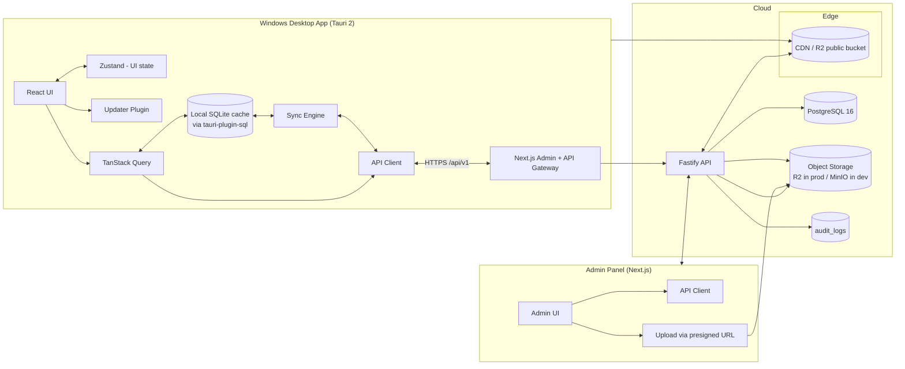
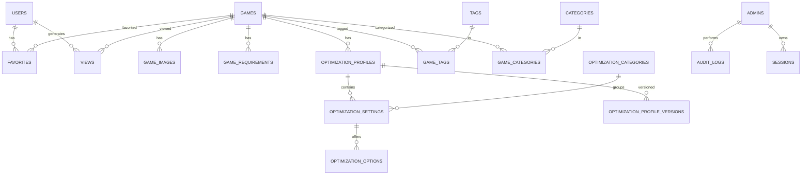

# Game Optimization Hub — System Architecture

> **Status:** Implemented (v0.1) — the design below reflects what shipped.
> **Last updated:** 2026-08-17

---

## 1. Overview

Game Optimization Hub is a commercial-grade gaming optimization platform with three surfaces:

1. **Desktop App (Windows)** — Tauri 2 + React. Browsing game library, viewing per-game optimization profiles (settings tables), favorites, offline cache, auto-update.
2. **Admin Panel (Web)** — Next.js. Full content management: games, images, categories, tags, optimization profiles/settings/options, versions, app versions, analytics, RBAC admin accounts.
3. **Backend API (Node.js)** — REST API + PostgreSQL. Single source of truth. All content is dynamic — **no game or optimization data is hardcoded in any client**.

Core product rule: an admin can add/edit/delete games and optimizations at runtime; the desktop app reflects changes without a rebuild.

---

## 2. System Architecture



**Key flows**

- **Desktop ↔ API:** Public, anonymous, cacheable endpoints (`/games`, `/home`, `/sync`). Desktop renders instantly from local SQLite cache, refreshes in background, and syncs incrementally (`?since=`).
- **Admin ↔ API:** Authenticated JWT endpoints with role-based authorization. Image uploads go **directly** to object storage via presigned URLs (API never proxies file bytes).
- **Content update:** Admin saves → DB. Desktop next sync (or app launch) pulls changes. No desktop rebuild ever required.

---

## 3. Monorepo Layout (npm workspaces)

```
game-optimization-hub/
├── apps/
│   ├── desktop/               # Tauri 2 + React + Vite + Tailwind (Windows)
│   │   ├── src/
│   │   │   ├── components/    # UI components (ui primitives, layout, game card)
│   │   │   ├── hooks/         # react-query hooks (useLibrary, useFavorites, useAppVersion)
│   │   │   ├── lib/           # api client, cache (localStorage CacheStore), sync engine, device
│   │   │   ├── pages/         # route components (Home, Games, GameDetail, Settings...)
│   │   │   ├── store/         # Zustand UI state (sidebar, filters, language, sync status)
│   │   │   └── i18n.ts        # i18next (en + fa, RTL-ready)
│   │   ├── scripts/           # placeholder icon generator (zero deps)
│   │   └── src-tauri/         # Rust shell, capabilities, icons, bundling config
│   ├── admin/                 # Next.js 15 (App Router) + Tailwind + shadcn/ui
│   │   └── app/
│   │       ├── (auth)/login
│   │       ├── (dashboard)/   # dashboard, games, optimizations, categories, ...
│   │       └── api/           # ONLY auth/upload proxy routes (see §11)
│   └── api/                   # Fastify + Drizzle + PostgreSQL
│       ├── src/
│       │   ├── modules/       # feature modules: auth, games, optimizations, analytics, ...
│       │   ├── db/            # drizzle schema + client
│       │   ├── plugins/       # auth, rbac, rate-limit, validation, swagger
│       │   ├── services/      # business logic (storage driver, versioning)
│       │   └── seed/          # seed scripts (games, profiles, admin)
│       └── drizzle/           # generated SQL migrations
├── packages/
│   ├── types/                 # shared TS types (generated from Zod)
│   ├── validation/            # Zod schemas — single source of API contract
│   └── config/                # shared eslint / tsconfig presets
├── docs/                      # ARCHITECTURE, API, SETUP, PRODUCTION, SECURITY
├── infrastructure/
│   ├── docker-compose.yml     # postgres + minio (dev)
│   └── tauri-update-server/   # static update.json manifest for Tauri updater
└── .github/workflows/         # CI (typecheck/lint/test/build) + desktop release
```

---

## 4. Tech Stack & Key Decisions

| Area | Decision | Rationale | Alternative considered |
|---|---|---|---|
| API framework | **Fastify 5** + `fastify-type-provider-zod` | High performance, first-class TypeScript, schema validation built in, auto **OpenAPI spec** from Zod (deliverable: API contract) | NestJS (heavier, more boilerplate), Express (untyped) |
| ORM / migrations | **Drizzle ORM** + drizzle-kit | Type-safe SQL, no query-engine binary, SQL-first control for analytics, migrations committed to repo | Prisma (great DX, but heavier runtime) |
| Database | **PostgreSQL 16** | Required by spec; `pg_trgm` for fast search, jsonb for flexible tech flags | — |
| Admin panel | **Next.js 15 App Router** + Tailwind + shadcn/ui | Required by spec; server components for dashboard, easy auth middleware | Vite SPA (no server needed for pure admin, but Next covers auth/RBAC middleware cleanly) |
| Desktop | **Tauri 2** + React + Vite + Tailwind + Lucide | Spec requirement; small binary (~10 MB), low RAM | Electron (rejected: size/RAM) |
| Desktop state | TanStack Query (server state) + Zustand (UI state) + **`CacheStore` (localStorage) behind a store interface** | Query handles caching/retry/offline; the cache interface keeps a future SQLite-backed store (`tauri-plugin-sql`) a drop-in replacement | Raw SQLite now (more setup, same API) |
| Validation / types | **Zod in `packages/validation`**, shared by API (input validation) and clients (types via `z.infer`) | Single source of truth for the API contract | hand-written types (drift risk) |
| Auth (admin) | Access JWT (15 min) + rotating refresh token (hashed in DB, httpOnly cookie) | Revocable sessions, safe logout, no token storage in admin bundle | Pure JWT (no revocation), sessions-only |
| Desktop identity | **Anonymous device profile** — one POST on first run creates a `user` row keyed by device ID | Gives analytics (active users, views, favorites) without forcing signup; account system can be added later | Full signup now (scope creep in v1) |
| Image storage | **S3-compatible object storage** (Cloudflare R2 prod, MinIO dev) behind a `StorageDriver` interface; **presigned uploads** | Spec requirement; files never hit the DB; CDN-served; dev works offline with MinIO | Local disk in API (breaks CDN story) |
| Auto-update | **Tauri updater** (signed, minisign) + `app_versions` table as the in-app source of truth | Standard, secure path; banner driven by API, download via updater | Custom downloader (reinventing wheel) |

---

## 5. Data Model (ERD)

All tables use `uuid` PKs, `created_at`, `updated_at`; soft-delete (`deleted_at`) where content is user-facing.



**Table summary** (19 tables):

| Table | Purpose | Notable columns |
|---|---|---|
| `users` | Desktop devices / future accounts | `device_id` (unique), `email` (nullable, for future accounts), `last_seen_at` |
| `admins` | Admin panel accounts | `email` (unique), `password_hash` (argon2id), `role` |
| `sessions` | Refresh-token store (rotation) | `token_hash`, `expires_at`, `revoked_at`, `ip`, `user_agent` |
| `games` | Core content | `slug`, `name`, `developer`, `publisher`, `release_date`, `engine`, `api`, `technologies jsonb` (dlss/fsr/xess/rt/fg/nvidia/amd/intel), `performance_rating`, `featured`, `status` (draft/published/archived), `view_count` |
| `game_images` | Cover / background / logo / screenshots | `type`, `url`, `object_key`, `alt_text`, `sort_order` |
| `categories` | Browse categories (Action, Open World…) | `slug`, `name`, `sort_order` |
| `game_categories` | M2M | composite PK |
| `tags` + `game_tags` | Free-form tags | `slug`, `name` |
| `game_requirements` | Min/Recommended specs | `tier` (minimum/recommended), `os`, `cpu`, `gpu`, `ram_mb`, `storage_gb`, `directx` — unique (game, tier) |
| `optimization_profiles` | Per-game profiles (Max FPS, Balanced…) | `slug`, `name`, `target_fps`, `hardware_tier` (low/mid/high/ultra), `version` (semver), `status`, `is_default`, `view_count`, `published_at` |
| `optimization_categories` | Global groups: Graphics, Performance, Display, Ray Tracing, Upscaling, Post Processing… | `slug`, `name`, `sort_order` |
| `optimization_settings` | One row per setting per profile | `name`, `setting_key`, `type` (select/boolean/slider/text), `category_id`, `sort_order` |
| `optimization_options` | Options of a select setting | `value`, `label`, `is_recommended`, `sort_order` |
| `optimization_profile_versions` | Version snapshots (history, rollback) | `version`, `data jsonb` (full snapshot), `change_note`, `created_by` |
| `favorites` | Per-user favorites | unique (user_id, game_id) |
| `views` | Privacy-friendly analytics | `user_id` (nullable), `game_id`, `profile_id`, `viewed_at` — indexed for rollups |
| `audit_logs` | Every admin mutation | `admin_id`, `action`, `entity_type`, `entity_id`, `before`/`after jsonb`, `ip` |
| `app_versions` | Desktop release manifest | `version`, `platform`, `channel`, `release_notes`, `download_url`, `checksum_sha256`, `is_latest` |

**Versioning model:** `optimization_profiles.version` is the live semver. Publishing a new version writes a snapshot to `optimization_profile_versions` and bumps `published_at`. The desktop app stores the last-seen version per profile locally and shows **"New optimization available v1.4.2"** when the server version is newer (detected via `/sync`).

---

## 6. API Design

Base path: `/api/v1`. Envelope: `{ "data": …, "meta": { page, limit, total } }` on success; `{ "error": { code, message, details } }` on failure. Pagination everywhere. Public GETs are cacheable (ETag / Cache-Control).

### Public endpoints (desktop app, anonymous, rate-limited)

| Method | Path | Purpose |
|---|---|---|
| GET | `/health` | Liveness |
| GET | `/home` | One-shot payload for Home: featured hero + popular + recently added + categories |
| GET | `/games` | Paginated library; filters `q` (name/genre/tags), `genre`, `year`, `technologies` (dlss, fsr, xess, rt, fg, nvidia, amd, intel), `sort` (popular/new/rating/name) |
| GET | `/games/:slug` | Full detail: description, dev/publisher, date, engine, api, tech flags, images, requirements (min/rec), categories, tags, rating |
| GET | `/games/:slug/optimizations` | Published profiles, settings grouped by optimization category, options, versions |
| GET | `/games/:slug/optimizations/:profileSlug` | Single profile |
| GET | `/categories` | Browse categories |
| GET | `/featured` | Featured games (hero carousel) |
| GET | `/sync?since=ISO` | **Incremental content sync** — games/profiles/categories/versions changed after `since` + server `content_updated_at`. Backbone of offline cache refresh |
| GET | `/app/version?current=&platform=&channel=` | Latest app version + update availability |
| GET | `/settings` | Public app settings (banner, min version…) |
| POST | `/users/device` | First-run: register anonymous device → `deviceId` + `userId` |
| POST | `/views` | Anonymous analytics event (`gameId` / `profileId`) |

### Admin endpoints (JWT + RBAC)

| Area | Endpoints |
|---|---|
| Auth | `POST /admin/auth/login`, `POST /admin/auth/refresh`, `POST /admin/auth/logout`, `GET /admin/auth/me` |
| Games | CRUD `/admin/games`, PATCH status (publish/unpublish), images (`POST/DELETE /admin/games/:id/images`), requirements |
| Uploads | `POST /admin/uploads/presign` → returns presigned PUT URL + object key (direct-to-S3) |
| Profiles | CRUD `/admin/games/:id/profiles`, nested settings + options, `POST /admin/profiles/:id/versions` (bump semver + snapshot), `POST /admin/profiles/:id/publish` |
| Taxonomy | CRUD `/admin/categories`, `/admin/tags`, `/admin/optimization-categories` |
| Releases | CRUD `/admin/app-versions` |
| Admins | CRUD `/admin/admins` (**super_admin only**) |
| Audit | `GET /admin/audit-logs` |
| Analytics | `GET /admin/dashboard`, `/admin/analytics/top-games`, `/active-users`, `/recent-*` |

**RBAC matrix** (permission map in code, checked by middleware):

| Role | Games | Optimizations | Categories/Tags | Admins | Analytics | Audit |
|---|---|---|---|---|---|---|
| super_admin | full | full | full | full | full | full |
| admin | full | full | full | view | full | view |
| editor | create/edit | create/edit | create/edit | — | view | — |
| viewer | read | read | read | — | view | — |

---

## 7. Authentication Flows

### Admin (web)

```
POST /admin/auth/login  (email + password)
   → verify argon2id hash
   → access JWT (15 min, in memory/header) + refresh token (random 256-bit, hashed in sessions table, httpOnly cookie, SameSite=Strict, 30 days)
   → POST /admin/auth/refresh rotates the refresh token (old one revoked)
   → RBAC middleware resolves role → permission map per route
   → every mutation writes audit_logs (actor, before/after jsonb)
```

- Login endpoint rate-limited (e.g., 5/min/IP + exponential backoff) to blunt brute force.
- CSRF: refresh cookie is `SameSite=Strict` + `Origin` check on state-changing requests; CORS allowlist only the admin origin for credentialed requests.

### Desktop (anonymous device)

```
First run: generate deviceId (UUID, persisted in the local CacheStore)
   → POST /users/device  → { deviceId, userId }  (stored locally)
   → userId attached to /views events and future favorites sync
No credentials, no secrets, no tokens stored in the desktop bundle.
```

---

## 8. Desktop App Architecture

### Data flow (cache-first, offline-first)

```
Launch
  ├─ read local CacheStore (localStorage) → render Home instantly (featured/popular/recent)
  ├─ TanStack Query: GET /home + GET /sync?since=lastSyncTs
  │     ├─ success → upsert cache, update lastSyncTs, refresh UI, show "New optimization available" badges
  │     └─ failure → stay on cache, show "Offline" pill, schedule retry (backoff)
  └─ background sync every N minutes + on reconnect (network plugin)
```

- **Desktop cache (`CacheStore`):** home payload, game summaries/details, profiles + per-profile versions (for "new optimization" badges), favorites, recently viewed, `last_sync_ts`, anonymous `device_id`. Backed by localStorage; the interface is SQLite-ready.
- **Images:** URLs point at CDN; Tauri webview HTTP cache + Lazy Loading + `loading="lazy"` on cards. No images are bundled.
- **Favorites / Recently viewed:** local-first (instant, offline); schema is sync-ready for a future account system.

### Pages

`Home` (hero + Popular + Recently Added + Recommended-for-your-PC placeholder) · `Games` (search + filters) · `Game Detail` (artwork header, info, requirements, profiles, settings table) · `Categories` · `Recommended` · `Favorites` · `Recently Viewed` · `Settings` · `About`. Collapsible sidebar; keyboard-accessible; i18n (en + fa scaffold with RTL-ready logical CSS).

### Hardware recommendation (modular, deferred)

V1 ships an `HardwareProfile` interface + a placeholder recommendation module ("Recommended for your PC" section reads an empty capability profile). Real detection (CPU/GPU/RAM/OS via Rust sysinfo) plugs into the same interface in a later version — **no partial implementation in v1** (spec §33/§9).

### One-click apply (architecture only, deferred)

V1 shows recommended settings only. The schema already carries `setting_key` + `value` per profile, which is exactly what a future game-specific config writer needs; the design (profile → key/value pairs, backup/restore, diff preview) is documented in `docs/PRODUCT.md` but not implemented.

---

## 9. Caching & Remote Content Update

- **Server side:** `updated_at` on every content row; `/sync?since=` returns only changed rows + a global `content_updated_at`. Public GETs send `ETag`/`Cache-Control` (short TTL for lists, longer for details).
- **Desktop side:** `CacheStore` (localStorage) + `last_sync_ts`; incremental upserts; offline renders from cache; reconnect triggers sync. "New optimization available" = server `version` > locally stored version for a game's profiles.
- **Versioning:** bumping a profile version in admin → snapshot row + `published_at` update → desktop sees it on next sync. This satisfies "admin adds Cyberpunk 2077 today, user sees it tomorrow, no rebuild" (§18).

---

## 10. Image Storage & Upload Flow

```
Admin panel
  → POST /admin/uploads/presign { kind: cover|background|logo, contentType, size }
  → API validates (allowlist: jpeg/png/webp; max 10 MB; kind exists) → returns { uploadUrl (presigned), objectKey }
  → browser PUTs bytes straight to R2/MinIO (no API proxy, no size blowup)
  → PATCH game/images { objectKey } → API stores public CDN URL in game_images
```

- `StorageDriver` interface: `LocalDriver` (dev — files served by API under `/uploads`, zero external deps) and `S3Driver` (prod — Cloudflare R2 / S3-compatible, public bucket + CDN).
- DB stores only `url` + `object_key` — never image bytes.

---

## 11. Security Checklist (§23 mapping)

- [ ] argon2id password hashing; admin passwords never stored in code
- [ ] Access JWT + rotating refresh tokens; sessions revocable server-side
- [ ] RBAC permission map; enforced in middleware, not just UI
- [ ] Rate limiting: auth (strict), public API (per-IP), views (per-device)
- [ ] Zod validation on **every** input; Drizzle parameterized queries (SQLi-safe)
- [ ] Helmet security headers (CSP, X-Frame-Options…), CORS allowlist, `SameSite=Strict` cookies + Origin check (CSRF)
- [ ] Upload allowlist + size cap + random object keys (no path traversal, no extension spoofing)
- [ ] Audit log for all admin mutations
- [ ] Tauri updater signatures (minisign); installer checksums in `app_versions`
- [ ] No secrets in desktop bundle — API URL is the only config, provided at build time via env
- [ ] Secrets via env files (`.env.example` committed, real values never)

---

## 12. Performance (1k–10k users) & Analytics

- Pagination on every list; GIN index (`pg_trgm`) on `games.name` for search; composite indexes on `views(game_id, viewed_at)`, `games(status, view_count)`, etc.
- Denormalized `games.view_count` / `profiles.view_count` incremented with the view insert (single transaction) — no COUNT(*) scans.
- `views` rows are append-only; monthly aggregation job (optional cron) rolls up into a `daily_stats` table for the dashboard.
- Single Node instance comfortably serves 10k users; scale path: read replica + Redis cache behind public GETs (documented, not built in v1).
- Analytics are privacy-friendly: only anonymous device IDs, no IP logging in views, no PII.

---

## 13. Infrastructure & Delivery

- **Dev (zero-dependency):** `npm run dev:embedded -w @goh/api` boots an embedded PostgreSQL, runs migrations + seed and starts the API on :4000 — no Docker or local Postgres required. `npm run dev -w @goh/desktop` starts the Vite dev server. The optional `infrastructure/docker-compose.yml` provides postgres:16 for teams that prefer it.
- **Tests:** the API's integration suite uses the same embedded Postgres (22 tests, incl. the "admin adds Cyberpunk 2077 → public API serves it instantly" flow, version bumps, RBAC, audit).
- **Migrations:** drizzle-kit SQL files committed under `apps/api/drizzle/`; applied via `drizzle-kit migrate` (documented).
- **CI:** GitHub Actions — typecheck + lint + test on all packages; desktop build (`windows-latest`, `tauri build`) on tag; release artifacts + `update.json` + checksums published (update server = static hosting or GitHub Releases).
- **Env config:** `.env.example` per app; `NODE_ENV`, `DATABASE_URL`, `S3_*`, `JWT_SECRET`, admin bootstrap password, desktop `VITE_API_URL`.

---

## 14. Implementation Phases (spec §38)

| # | Phase | Deliverable |
|---|---|---|
| 1 | Scaffold monorepo + DB schema + migrations + seed + API skeleton (OpenAPI) | `apps/api`, `packages/*`, schema, 15 seeded games |
| 2 | Admin auth | login/refresh/logout, RBAC, sessions, audit |
| 3 | Admin dashboard | stats, top games, recent activity |
| 4 | Game CRUD | games, images (presigned uploads), requirements, publish/unpublish |
| 5 | Optimization CRUD | profiles, settings, options, categories, versioning |
| 6 | Desktop app scaffold | Tauri 2 shell, layout, sidebar, theming, i18n |
| 7 | Desktop ↔ API | home, library, search/filter, detail, profiles |
| 8 | Caching + offline + sync | CacheStore (localStorage), `/sync`, offline mode, reconnect |
| 9 | Auto-update | `app_versions` API + Tauri updater wiring |
| 10 | Hardening | tests, security pass, production builds, docs (SETUP/PRODUCTION/API) |

---

## 15. Decisions Requested Before Implementation

1. **API stack:** Fastify + Drizzle (chosen) — typed Zod contracts, no ORM runtime overhead.
2. **Desktop identity:** anonymous device profiles (chosen) — analytics without forcing signup.
3. **Storage:** local driver for dev + S3/R2 driver for prod behind a `StorageDriver` interface (chosen).
4. **Favorites v1:** local-only, sync-ready schema (chosen).
5. **Admin panel:** single Next.js app hosting only auth/upload proxy routes; public API stays on Fastify (chosen).
6. All phases shipped; the implementation is complete and verified end-to-end (see README).
